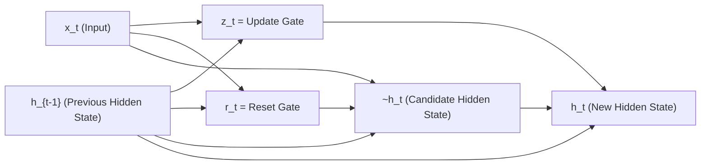
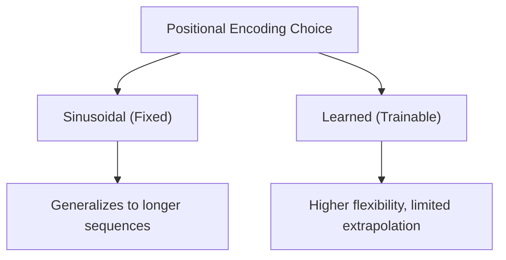
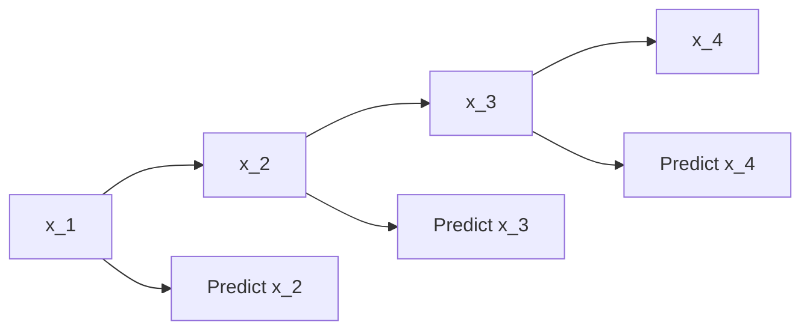
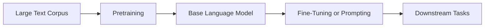

****# From RNNs to Transformers: The Technical Evolution of Sequence Models

## Abstract

This document presents a structured technical survey of the evolution of sequence modeling architectures, progressing from Recurrent Neural Networks (RNNs) to Long Short-Term Memory networks (LSTMs), attention mechanisms, and Transformer-based models. It integrates theoretical foundations, mathematically consistent formulations, architectural intuition, and practical PyTorch implementations. The document is intended as a professional reference for machine learning students, practitioners, and technical writers seeking a rigorous yet accessible treatment of modern sequence models.

---

## 1. Introduction to Sequence Modeling

### 1.1 The Sequential Data Challenge

Sequential data—such as natural language text, time-series signals, and speech—exhibits temporal dependencies in which the interpretation of a current element depends on previously observed elements. Unlike static data, sequential data is inherently ordered, and this ordering carries semantic meaning.

Standard feedforward neural networks assume inputs are independent and identically distributed. Consequently, they lack an internal mechanism for retaining information about prior inputs, making them unsuitable for tasks where historical context is essential.

Sequence modeling architectures address this limitation by introducing an internal *state* that evolves over time, enabling information from earlier time steps to influence future predictions.

---

### 1.2 Evolution Timeline of Sequence Models

| Architecture | Approximate Introduction |
|-------------|--------------------------|
| Recurrent Neural Networks (RNNs) | Early 1990s |
| Long Short-Term Memory (LSTM) | 1997 |
| Gated Recurrent Unit (GRU) | 2014 |
| Transformer | 2017 |
| Large Language Models (LLMs) | 2020s |

This progression reflects a steady shift from strictly sequential computation toward architectures that support parallelism, improved gradient flow, and scalable modeling of long-range dependencies.

---

## 2. Recurrent Neural Networks

### 2.1 Architectural Overview

A Recurrent Neural Network maintains a *hidden state* that is updated at each time step. This hidden state acts as a compact memory representation of previously processed inputs.

At time step $t$, the RNN receives an input vector $x_t$ and updates its hidden state $h_t$ based on the previous hidden state $h_{t-1}$. An output $y_t$ is then produced from the current hidden state. This recurrent structure enables the network to model temporal dependencies in sequential data.

---

### 2.2 Mathematical Formulation

The forward dynamics of a vanilla RNN are defined as:

$$
\begin{aligned}
h_t &= \tanh\left(W_{xh} x_t + W_{hh} h_{t-1} + b_h\right), \\
y_t &= W_{hy} h_t + b_y, \\
p_t &= \mathrm{softmax}(y_t)
\end{aligned}
$$

Here, $W_{xh}$ denotes the input-to-hidden weight matrix, $W_{hh}$ the recurrent (hidden-to-hidden) weight matrix, and $W_{hy}$ the hidden-to-output weight matrix. The vectors $b_h$ and $b_y$ are bias terms.

All parameters are shared across time steps, enabling the model to generalize to sequences of arbitrary length.

---

### 2.3 Unrolled Computation Graph

Although an RNN is defined recursively, training and theoretical analysis are facilitated by explicitly *unrolling* the network across time.

For an input sequence of length $T$, the RNN can be represented as a deep feedforward network with $T$ layers, where each layer corresponds to a single time step and shares the same parameters.

The hidden states evolve as:

$$
h_1 \rightarrow h_2 \rightarrow h_3 \rightarrow \cdots \rightarrow h_T
$$

This unrolled perspective reveals that the effective depth of the network grows linearly with the sequence length. Consequently, learning long-term dependencies requires propagating information across many nonlinear transformations.

---

## 3. Gradient Flow in Recurrent Neural Networks

### 3.1 Backpropagation Through Time (BPTT)

Recurrent Neural Networks are trained using *Backpropagation Through Time* (BPTT), a temporal extension of the standard backpropagation algorithm. During BPTT, the RNN is unrolled across all time steps, and gradients of the loss are propagated backward through the unrolled computation graph.

Let $L$ denote the total loss over a sequence of length $T$. The gradient of the loss with respect to the recurrent weight matrix $W_{hh}$ is given by:

$$
\frac{\partial L}{\partial W_{hh}} =
\sum_{t=1}^{T}
\frac{\partial L}{\partial h_t}
\frac{\partial h_t}{\partial W_{hh}}
$$

The gradient with respect to the hidden state at time step $t$ depends recursively on future hidden states:

$$
\frac{\partial L}{\partial h_t} =
\sum_{k=t}^{T}
\frac{\partial L}{\partial h_k}
\prod_{i=t+1}^{k}
\frac{\partial h_i}{\partial h_{i-1}}
$$

This recursive dependency is the fundamental source of instability in gradient propagation for vanilla RNNs.

---

### 3.2 Vanishing and Exploding Gradients

For a vanilla RNN using the $\tanh$ activation function, the Jacobian of the hidden-state transition is:

$$
\frac{\partial h_t}{\partial h_{t-1}} =
\mathrm{diag}(1 - h_t^2)\, W_{hh}
$$

Repeated multiplication of this Jacobian across time steps causes gradients to decay or grow exponentially. If the spectral radius of $W_{hh}$ is less than one, gradients vanish; if it exceeds one, gradients explode.

An approximate bound on the gradient magnitude is:

$$
\left\|
\frac{\partial L}{\partial h_t}
\right\|
\approx
\left\|
\frac{\partial L}{\partial h_T}
\right\|
\prod_{i=t+1}^{T}
\left\| W_{hh} \right\|
$$


### Unrolled computation graph

Although a Recurrent Neural Network is defined using a recursive formulation, its behavior during training and inference is best understood by explicitly *unrolling* the network across time.

For an input sequence of length $T$, the RNN can be represented as a deep feedforward network with $T$ layers, where each layer corresponds to one time step. All layers share the same parameters, but each maintains its own hidden state.

At each time step $t$, the hidden state is computed as:

$$
h_t = \tanh\left(W_{xh} x_t + W_{hh} h_{t-1} + b_h\right)
$$

Unrolling the recurrence produces a chain of hidden states:

$$
h_1 \rightarrow h_2 \rightarrow h_3 \rightarrow \cdots \rightarrow h_T
$$

From this perspective, an RNN is equivalent to a deep neural network whose effective depth grows linearly with the sequence length. While parameter sharing prevents the number of learnable parameters from increasing, the depth of the computational graph increases with longer sequences.

This unrolled representation is critical for understanding how information and gradients propagate through time, and it forms the basis for the training algorithm used for recurrent models.

## Pytorch implementation

```python
import torch
import torch.nn as nn
import torch.optim as optim
import numpy as np

# 1. Data preparation (simple example: train on "hello world" repeated)
text = "hello world " * 500  # small repeated corpus for demo
chars = sorted(list(set(text)))
char_to_idx = {ch: i for i, ch in enumerate(chars)}
idx_to_char = {i: ch for i, ch in enumerate(chars)}
vocab_size = len(chars)

# Create sequences: input = chars[0..n-1], target = chars[1..n]
seq_length = 25
inputs = []
targets = []
for i in range(0, len(text) - seq_length):
    inputs.append([char_to_idx[ch] for ch in text[i:i+seq_length]])
    targets.append([char_to_idx[ch] for ch in text[i+1:i+seq_length+1]])

inputs = torch.tensor(inputs, dtype=torch.long)   # shape: (num_seq, seq_length)
targets = torch.tensor(targets, dtype=torch.long)

# 2. Model definition
class CharRNN(nn.Module):
    def __init__(self, vocab_size, embed_size=64, hidden_size=128, num_layers=1):
        super().__init__()
        self.embedding = nn.Embedding(vocab_size, embed_size)
        self.rnn = nn.RNN(embed_size, hidden_size, num_layers, batch_first=True)
        self.fc = nn.Linear(hidden_size, vocab_size)
    
    def forward(self, x, hidden=None):
        x = self.embedding(x)                # (batch, seq_len) → (batch, seq_len, embed)
        out, hidden = self.rnn(x, hidden)    # out: (batch, seq_len, hidden)
        out = self.fc(out)                   # → (batch, seq_len, vocab)
        return out, hidden

# 3. Instantiate
model = CharRNN(vocab_size)
criterion = nn.CrossEntropyLoss()
optimizer = optim.Adam(model.parameters(), lr=0.005)

# 4. Training loop (simplified)
num_epochs = 50
for epoch in range(num_epochs):
    hidden = None
    total_loss = 0
    for i in range(0, len(inputs), 32):  # mini-batch
        batch_x = inputs[i:i+32]
        batch_y = targets[i:i+32]
        
        optimizer.zero_grad()
        output, hidden = model(batch_x, hidden)
        # Reshape for loss: (batch*seq, vocab) and (batch*seq)
        loss = criterion(output.view(-1, vocab_size), batch_y.view(-1))
        loss.backward()
        optimizer.step()
        
        total_loss += loss.item()
    
    print(f"Epoch {epoch+1}/{num_epochs}, Loss: {total_loss / (len(inputs)/32):.4f}")

# 5. Generation example (after training)
def generate_text(model, start_text="hello", length=200, temperature=0.8):
    model.eval()
    chars = [char_to_idx[ch] for ch in start_text]
    hidden = None
    generated = list(start_text)
    
    for _ in range(length):
        x = torch.tensor([chars[-1]], dtype=torch.long).unsqueeze(0)  # last char
        out, hidden = model(x, hidden)
        probs = nn.functional.softmax(out[0, -1] / temperature, dim=-1)
        next_idx = torch.multinomial(probs, 1).item()
        generated.append(idx_to_char[next_idx])
        chars.append(next_idx)
    
    return ''.join(generated)

print(generate_text(model))
```

## 3. Gradient Flow in Recurrent Neural Networks

### 3.1 Backpropagation Through Time (BPTT)

Recurrent Neural Networks are trained using *Backpropagation Through Time* (BPTT), a variant of the standard backpropagation algorithm adapted to sequential architectures. During BPTT, the RNN is first unrolled across all time steps, after which gradients of the loss are propagated backward through the unrolled computation graph.

Let $L$ denote the total loss over a sequence of length $T$. The gradient of the loss with respect to the recurrent weight matrix $W_{hh}$ is given by:

$$
\frac{\partial L}{\partial W_{hh}} =
\sum_{t=1}^{T}
\frac{\partial L}{\partial h_t}
\frac{\partial h_t}{\partial W_{hh}}
$$

The gradient with respect to the hidden state at time step $t$ depends recursively on future time steps:

$$
\frac{\partial L}{\partial h_t} =
\sum_{k=t}^{T}
\frac{\partial L}{\partial h_k}
\prod_{i=t+1}^{k}
\frac{\partial h_i}{\partial h_{i-1}}
$$

This recursive dependency causes gradients to be repeatedly multiplied as they are propagated backward through time.

---

### 3.2 Vanishing and Exploding Gradients

For a vanilla RNN with a $\tanh$ activation function, the Jacobian of the hidden-state transition is given by:

$$
\frac{\partial h_t}{\partial h_{t-1}} =
\mathrm{diag}(1 - h_t^2)\, W_{hh}
$$

During backpropagation, gradients are multiplied by this Jacobian at each time step. If the spectral radius of $W_{hh}$ is less than one, gradient magnitudes decay exponentially as they propagate backward, resulting in the *vanishing gradient problem*. If the spectral radius exceeds one, gradients grow exponentially, leading to the *exploding gradient problem*.

An approximate bound on the gradient magnitude is:

$$
\left\|
\frac{\partial L}{\partial h_t}
\right\|
\approx
\left\|
\frac{\partial L}{\partial h_T}
\right\|
\prod_{i=t+1}^{T}
\left\| W_{hh} \right\|
$$

This exponential dependence on sequence length makes training unstable for long sequences.

---

### 3.3 Implications for Long-Term Dependency Modeling

When gradients vanish, early time steps receive negligible parameter updates, preventing the network from learning long-range temporal dependencies. While techniques such as gradient clipping can mitigate exploding gradients, they do not resolve vanishing gradients.

These structural limitations motivated the development of gated recurrent architectures, particularly Long Short-Term Memory (LSTM) networks, which introduce additive state transitions designed to preserve gradient flow across long time horizons.

## 4. Long Short-Term Memory Networks

### 4.1 Motivation for LSTMs

Vanilla Recurrent Neural Networks struggle to model long-term dependencies due to the vanishing and exploding gradient problem. As gradients are propagated backward through many time steps, repeated multiplication by the recurrent weight matrix causes them to decay or grow exponentially.

Long Short-Term Memory (LSTM) networks were introduced to address this limitation by modifying the internal state dynamics of RNNs. The key idea behind LSTMs is the introduction of an explicit *memory cell* and *gating mechanisms* that regulate the flow of information through time.

Unlike vanilla RNNs, LSTMs use additive state updates rather than purely multiplicative transitions. This structural change enables gradients to flow backward through time more effectively, allowing the network to retain information over long sequences.

---

### 4.2 Core Components of an LSTM Cell

An LSTM cell maintains two state vectors at each time step:

- The **cell state** $c_t$, which acts as long-term memory
- The **hidden state** $h_t$, which represents the output of the cell

Information flow within the LSTM cell is controlled by three multiplicative gates:

1. **Forget gate** — determines what information to discard from the cell state
2. **Input gate** — determines what new information to store
3. **Output gate** — determines what information to expose as output

Each gate produces values in the range $(0, 1)$ using a sigmoid activation function, allowing the network to softly control information flow.

---

### 4.3 Mathematical Formulation of the LSTM

Given an input vector $x_t$, previous hidden state $h_{t-1}$, and previous cell state $c_{t-1}$, the LSTM computes the following gate activations:

$$
f_t = \sigma\left(W_f x_t + U_f h_{t-1} + b_f\right)
$$

$$
i_t = \sigma\left(W_i x_t + U_i h_{t-1} + b_i\right)
$$

$$
o_t = \sigma\left(W_o x_t + U_o h_{t-1} + b_o\right)
$$

Here, $f_t$, $i_t$, and $o_t$ denote the forget, input, and output gates respectively. The matrices $W_*$ and $U_*$ are learnable weight matrices, and $b_*$ are bias vectors.

A candidate cell state $\tilde{c}_t$ is computed as:

$$
\tilde{c}_t = \tanh\left(W_c x_t + U_c h_{t-1} + b_c\right)
$$

The cell state is then updated using an additive rule:

$$
c_t = f_t \odot c_{t-1} + i_t \odot \tilde{c}_t
$$

Finally, the hidden state is computed as:

$$
h_t = o_t \odot \tanh(c_t)
$$

The operator $\odot$ denotes element-wise multiplication.

### 4.4 Pytorch implementation: Character-level LSTM

```python
import torch
import torch.nn as nn
import torch.optim as optim
import numpy as np

# 1. Data preparation (same as RNN example: repeated "hello world" for demo)
text = "hello world " * 500
chars = sorted(list(set(text)))
char_to_idx = {ch: i for i, ch in enumerate(chars)}
idx_to_char = {i: ch for ch in chars}
vocab_size = len(chars)

seq_length = 25
inputs = []
targets = []
for i in range(len(text) - seq_length):
    inputs.append([char_to_idx[ch] for ch in text[i:i+seq_length]])
    targets.append([char_to_idx[ch] for ch in text[i+1:i+seq_length+1]])

inputs = torch.tensor(inputs, dtype=torch.long)   # (num_seq, seq_len)
targets = torch.tensor(targets, dtype=torch.long)

# 2. Model definition
class CharLSTM(nn.Module):
    def __init__(self, vocab_size, embed_size=64, hidden_size=128, num_layers=1):
        super().__init__()
        self.embedding = nn.Embedding(vocab_size, embed_size)
        self.lstm = nn.LSTM(embed_size, hidden_size, num_layers, batch_first=True)
        self.fc = nn.Linear(hidden_size, vocab_size)
    
    def forward(self, x, hidden=None):
        x = self.embedding(x)                   # (batch, seq_len) → (batch, seq_len, embed)
        out, hidden = self.lstm(x, hidden)      # out: (batch, seq_len, hidden), hidden: (h_n, c_n)
        out = self.fc(out)                      # → (batch, seq_len, vocab)
        return out, hidden

# 3. Instantiate model
model = CharLSTM(vocab_size)
criterion = nn.CrossEntropyLoss()
optimizer = optim.Adam(model.parameters(), lr=0.005)

# 4. Training loop
num_epochs = 50
for epoch in range(num_epochs):
    hidden = None  # (h_0, c_0) — LSTM returns/accepts tuple
    total_loss = 0
    for i in range(0, len(inputs), 32):  # mini-batches
        batch_x = inputs[i:i+32]
        batch_y = targets[i:i+32]
        
        optimizer.zero_grad()
        output, hidden = model(batch_x, hidden)
        
        # Reshape for loss: flatten seq and batch dims
        loss = criterion(output.view(-1, vocab_size), batch_y.view(-1))
        loss.backward()
        optimizer.step()
        
        total_loss += loss.item()
    
    avg_loss = total_loss / (len(inputs) / 32)
    print(f"Epoch {epoch+1}/{num_epochs}, Loss: {avg_loss:.4f}")

# 5. Generation function (autoregressive sampling)
@torch.no_grad()
def generate_text(model, start_text="hello", length=200, temperature=0.8):
    model.eval()
    chars_list = [char_to_idx[ch] for ch in start_text]
    hidden = None
    generated = list(start_text)
    
    for _ in range(length):
        x = torch.tensor([[chars_list[-1]]], dtype=torch.long)  # (1, 1)
        out, hidden = model(x, hidden)
        probs = nn.functional.softmax(out[0, -1] / temperature, dim=-1)
        next_idx = torch.multinomial(probs, num_samples=1).item()
        generated.append(idx_to_char[next_idx])
        chars_list.append(next_idx)
    
    return ''.join(generated)

# Example usage after training
print("Generated text:", generate_text(model))
```

### 4.4 Gradient Flow Through the Cell State

The defining property of LSTMs is the additive update of the cell state. The partial derivative of the cell state with respect to its previous value is:

$$
\frac{\partial c_t}{\partial c_{t-1}} = f_t
$$

Since the forget gate values lie in the interval $(0, 1)$, the gradient can be preserved across many time steps when $f_t \approx 1$. This mechanism prevents exponential decay of gradients and enables long-term memory retention.

This pathway is often referred to as the *constant error carousel*, as it allows gradients to circulate through time without vanishing.

---

### 4.5 Comparison with Vanilla RNNs

In a vanilla RNN, the hidden state update is defined as:

$$
h_t = \tanh\left(W_{hh} h_{t-1} + W_{xh} x_t + b_h\right)
$$

This formulation relies entirely on multiplicative transformations, making gradient stability dependent on the spectral properties of $W_{hh}$.

In contrast, LSTMs decouple memory storage from output computation and introduce gated additive updates. This architectural change significantly improves stability during training and enables the modeling of long-range dependencies.

---

### 4.6 Computational Considerations

While LSTMs are more expressive than vanilla RNNs, they incur higher computational and memory costs due to the presence of multiple gates and additional parameters.

Specifically, an LSTM cell contains four separate linear transformations for each input and hidden state, resulting in approximately four times the parameter count of a vanilla RNN with the same hidden dimension.

Despite this overhead, LSTMs became the dominant sequence modeling architecture for many years due to their superior performance on tasks such as language modeling, speech recognition, and machine translation.

## 5. Gated Recurrent Units

### 5.1 Motivation for GRUs

Although Long Short-Term Memory networks significantly improve gradient flow and long-range dependency modeling, they introduce substantial architectural complexity. Each LSTM cell contains multiple gates and maintains two separate state vectors, increasing computational cost and parameter count.

Gated Recurrent Units (GRUs) were proposed as a simplified alternative to LSTMs. The primary motivation behind GRUs is to retain the benefits of gated memory while reducing architectural complexity. GRUs achieve this by merging the cell state and hidden state into a single representation and reducing the number of gates.

Despite their simpler structure, GRUs often achieve performance comparable to LSTMs on many sequence modeling tasks.

---

### 5.2 Core Components of a GRU Cell

A GRU maintains a single hidden state vector $h_t$ at each time step. Information flow through the GRU is regulated using two gates:

1. **Update gate** — controls how much of the previous hidden state is retained
2. **Reset gate** — controls how much past information is ignored when computing the candidate hidden state

Both gates use sigmoid activations, producing values in the interval $(0, 1)$.


### 5.3 Mathematical Formulation of the GRU

Let$\mathcal{X} = \{x_1, x_2, \dots, x_T\}$ be an input sequence of length $T$. For each time step $t \in \{1, \dots, T\}$, the Gated Recurrent Unit (GRU) computes the current hidden state $h_t \in \mathbb{R}^d$ based on the current input vector $x_t$ and the previous hidden state $h_{t-1}$.

**Gating Mechanisms**

The GRU employs two primary gates to regulate information flow: the update gate ($z_t$) and the reset gate ($r_t$). These are computed as follows:

$$z_t = \sigma(W_z x_t + U_z h_{t-1} + b_z)$$

$$r_t = \sigma(W_r x_t + U_r h_{t-1} + b_r)$$

Where:
$\sigma(\cdot)$ is the sigmoid activation function, mapping values to $(0, 1)$.$W_z, W_r$ are weight matrices for the input $x_t$.$U_z, U_r$ are weight matrices for the previous hidden state $h_{t-1}$.$b_z, b_r$ are bias vectors.

**Candidate and Final Hidden**

 StateThe candidate hidden state $\tilde{h}_t$ uses the reset gate to determine how much of the past state $h_{t-1}$ should be "forgotten" before incorporating the new input:

 $$\tilde{h}_t = \tanh(W_h x_t + U_h (r_t \odot h_{t-1}) + b_h)$$

 The hidden state $h_t$ is updated by interpolating between the previous state and the candidate state using the update gate $z_t$:

$$h_t = (1 - z_t) \odot h_{t-1} + z_t \odot \tilde{h}_t$$

In this equation, $\odot$ denotes the element-wise (Hadamard) product. This linear interpolation is the core mechanism that allows the GRU to maintain information over long sequences, effectively bypassing the vanishing gradient problem.

### 5.4 Gradient Flow and Memory Retention

The additive structure of the hidden state update in GRUs enables stable gradient propagation across time steps. The update gate $z_t$ directly controls the contribution of the previous hidden state to the current state.
When $z_t$ is small, the GRU preserves most of the previous hidden state, enabling long-term memory retention. When $z_t$ is large, the model prioritizes newly computed information.
This gating mechanism allows GRUs to mitigate vanishing gradients in a manner similar to LSTMs, despite lacking an explicit cell state.

### 5.5 Comparison with LSTMs

While LSTMs maintain separate cell and hidden states and employ three gates, GRUs consolidate these components into a simpler architecture with two gates and a single state vector.
This simplification reduces the number of parameters and often leads to faster training and inference. However, the absence of an explicit cell state may limit the expressiveness of GRUs in tasks requiring extremely long-term memory.
Empirically, the performance gap between GRUs and LSTMs is task-dependent, with neither architecture universally outperforming the other.

### 5.6 Computational Efficiency

Due to their reduced number of gates and parameters, GRUs are computationally more efficient than LSTMs. This efficiency makes them attractive in scenarios with limited computational resources or when faster convergence is desired.
Nevertheless, both GRUs and LSTMs remain inherently sequential models, limiting their ability to fully exploit parallel computation across time steps.

**Gated Recurrent Unit (GRU) Architecture**

A Gated Recurrent Unit (GRU) is a recurrent neural network (RNN) architecture designed to efficiently model sequential data while mitigating problems such as the vanishing gradient. It achieves this through gating mechanisms that regulate the flow of information across time steps, allowing the model to retain relevant information and discard irrelevant details.
At each time step $t$, the GRU processes the current input $x_t$ together with the previous hidden state $h_{t-1}$ to compute the new hidden state $h_t$.

### 1. Update Gate
The update gate controls how much of the previous hidden state should be preserved in the new hidden state. It enables the GRU to decide whether to keep old information or replace it with newly computed information.

$$z_t = \sigma(W_z x_t + U_z h_{t-1} + b_z)$$

Here:

$ \sigma(\cdot) $ is the sigmoid activation function,
$ W_z $ and $ U_z $ are weight matrices,
$ b_z $ is a bias vector.

When $ z_t $ is close to 1, the model retains most of the past information. When it is close to 0, the model prioritizes new information. This mechanism allows GRUs to capture long-term dependencies effectively.

### Reset Gate

The reset gate determines how much of the previous hidden state should influence the computation of new information. It allows the model to forget irrelevant past information when necessary.

$$r_t = \sigma(W_r x_t + U_r h_{t-1} + b_r)$$

If $ r_t $ is close to 0, the past hidden state is largely ignored. If it is close to 1, the past hidden state strongly influences the new computation. This gate is particularly useful when the relevance of past context changes over time.

### 3. Candidate Hidden State

The candidate hidden state represents new information that could be added to the model’s memory. It is computed using the current input and a gated version of the previous hidden state.

$$\tilde{h}_t = \tanh(W_h x_t + U_h (r_t \odot h_{t-1}) + b_h)$$

Where:

$ \tanh(\cdot) $ is the hyperbolic tangent activation function,
$ \odot $ denotes element-wise multiplication.

The reset gate ensures that only relevant parts of the past hidden state contribute to this candidate state.

### 4. New Hidden State
The new hidden state is obtained by combining the previous hidden state and the candidate hidden state using the update gate.

$$h_t = z_t \odot h_{t-1} + (1 - z_t) \odot \tilde{h}_t$$

This formulation performs a smooth interpolation between old and new information. As a result, the GRU avoids abrupt state changes and maintains stable learning dynamics.

### 7. Transformer Architecture

### 7.1 Motivation for the Transformer

Although attention mechanisms significantly improved sequence modeling, early attention-based models still relied on recurrent structures in both the encoder and decoder. This reliance imposed a fundamental limitation: computations could not be fully parallelized across time steps.
The Transformer architecture was introduced to eliminate recurrence entirely and rely solely on attention mechanisms. By removing sequential dependencies during computation, Transformers enable full parallelization, faster training, and more effective modeling of long-range dependencies.

### 7.2 Self-Attention Mechanism
Self-attention allows each element in a sequence to attend to all other elements in the same sequence. Instead of processing tokens sequentially, the model computes interactions between all tokens simultaneously.
Given an input sequence represented as a matrix $X \in \mathbb{R}^{T \times d}$, three projections are computed:

Queries: $Q = XW_Q$
Keys: $K = XW_K$
Values: $V = XW_V$

The self-attention output is computed as:

$\text{Attention}(Q, K, V) = \text{softmax}\left(\frac{QK^\top}{\sqrt{d_k}}\right)V$

where $d_k$ is the dimension of the keys/queries.

### 8. Positional Encoding

**Why Positional Information Is Necessary**

Transformers process tokens in parallel and have no inherent notion of order. However, token order is critical ( “the dog chased the cat” vs. “the cat chased the dog”).
Positional encodings are therefore added to token embeddings to inject position information.

**Sinusoidal Positional Encoding (original Transformer)**

$$
\begin{aligned}
PE_{(pos, 2i)} &= \sin\left( \frac{pos}{10000^{\frac{2i}{d_{model}}}} \right) \\
PE_{(pos, 2i+1)} &= \cos\left( \frac{pos}{10000^{\frac{2i}{d_{model}}}} \right)
\end{aligned}
$$

Why this formatting works:

$x_{\text{pos}} = \text{TokenEmbedding}_{\text{pos}} + PE(\text{pos}, \cdot)$

**Learned Positional Embeddings**

An alternative approach is to treat positional encodings as trainable parameters. In this case, each position has an associated embedding vector that is learned during training, similar to token embeddings.

Learned positional embeddings often perform well in practice, especially when sequence lengths are fixed or bounded. However, unlike sinusoidal encodings, they do not naturally generalize to sequence lengths longer than those seen during training.



By incorporating positional encodings into input representations, self-attention layers become position-aware. Attention scores are influenced not only by token content but also by token position, enabling the model to distinguish between different orderings of the same tokens.

Without positional encodings, the Transformer would be permutation-invariant and incapable of modeling ordered sequences effectively.


**Properties**

Fixed (not learned) → no extra parameters

Generalizes to longer sequences than seen in training

Naturally encodes relative positions via linear combinations of sines/cosines

**Learned Positional Embeddings (alternative)**

Each position gets a trainable vector $PE(\text{pos}) \in \mathbb{R}^{d_{\text{model}}}$.

Advantages: more flexible, often better when sequence length is fixed

**Disadvantages:** poor extrapolation to longer sequences

---

## 9. Large Language Models (LLMs)

### 9.1 From Transformers to Large Language Models

Large Language Models (LLMs) are a direct extension of the Transformer architecture, scaled to billions or trillions of parameters and trained on massive text corpora. While the core architectural components—self-attention, multi-head attention, and feedforward layers—remain unchanged, LLMs differ primarily in scale, data diversity, and training objectives.

The defining insight behind LLMs is that sufficiently large Transformer models, when trained on diverse natural language data, learn general-purpose linguistic representations that can be adapted to a wide range of downstream tasks.

---

### 9.2 Autoregressive Language Modeling Objective

Most LLMs are trained using an autoregressive objective, where the model predicts the next token in a sequence given all previous tokens.

Given a sequence of tokens
Given a sequence of tokens:
Given a sequence of tokens $(x_1, x_2, \dots, x_T)$, the training objective is to maximize the log-likelihood:

$$
\log P(x_1, \dots, x_T) = \sum_{t=1}^{T} \log P(x_t \mid x_1, \dots, x_{t-1})
$$

This objective is implemented using a **causal (masked) self-attention mechanism**, which ensures that predictions at time step \(t\) depend only on earlier tokens.

---

### 📊 Autoregressive Prediction Flow


### 9.3 Causal Masking in Self-Attention

To enforce the autoregressive constraint, a causal mask is applied to the attention scores. This mask prevents tokens from attending to future positions
Formally, attention scores are modified as:

$$
\text{Attention}(Q, K, V) = \text{softmax}\left( \frac{QK^\top}{\sqrt{d_k}} + M \right) V
$$

where the mask matrix $$M$$ assigns large negative values to invalid (future) positions.

 ### Causal Self-Attention Mask

 ```mermaid
 flowchart TD
    T1[Token 1] --> T1
    T2[Token 2] --> T1
    T2 --> T2
    T3[Token 3] --> T1
    T3 --> T2
    T3 --> T3
```
### 9.4 Scaling Laws and Model Capacity

Empirical studies have shown that model performance improves predictably with increases in:

Model parameters

Training data size

Compute budget

These relationships, known as scaling laws, suggest that larger models trained on more data continue to improve without saturating quickly.

Scaling enables LLMs to:

Capture long-range dependencies

Learn syntactic and semantic regularities

Exhibit emergent abilities not present in smaller models

### 9.5 Pretraining and Transfer Learning

LLMs are typically pretrained on large unlabeled text corpora using the language modeling objective. After pretraining, the model can be adapted to specific tasks via fine-tuning or prompting.

This paradigm enables a single pretrained model to perform:

Text generation

Question answering

Summarization

Code generation

### Pretraining and adaptation pipelining



### 9.6 Limitations and Considerations

Despite their capabilities, LLMs face several challenges:

High computational and energy costs

Sensitivity to data quality and bias

Limited interpretability of internal representations

These considerations motivate ongoing research into more efficient architectures, alignment techniques, and interpretability methods.

---

## 10. Comparative Summary and Conclusion

### 10.1 Evolution of Sequence Modeling Architectures

The progression from Recurrent Neural Networks to Large Language Models reflects a continuous effort to address fundamental challenges in sequence modeling, particularly long-range dependency learning, gradient stability, and computational efficiency.

Each architectural innovation builds directly upon the limitations of its predecessors, resulting in increasingly expressive and scalable models.

---

### 10.2 Architectural Comparison

| Model | Core Mechanism | Long-Term Dependency Handling | Parallelism | Computational Cost |
|------|---------------|-------------------------------|-------------|--------------------|
| RNN | Recurrence | Poor | None | Low |
| LSTM | Gated recurrence + cell state | Good | None | Moderate |
| GRU | Simplified gating | Good | None | Moderate |
| Attention (RNN-based) | Dynamic weighting | Very Good | Limited | High |
| Transformer | Self-attention | Excellent | Full | High |
| LLMs | Scaled Transformers | Excellent | Full | Very High |

---

### 10.3 Computational and Modeling Trade-offs

Recurrent models process sequences sequentially, which limits parallelization and increases training time. However, they are memory-efficient and suitable for shorter sequences or low-resource environments.

Transformers eliminate recurrence, enabling full parallelism and superior modeling of global dependencies. This comes at the cost of quadratic attention complexity with respect to sequence length, making optimization and scaling critical concerns.

Large Language Models amplify these trade-offs by scaling parameters and data, achieving remarkable generalization at the expense of computational and environmental cost.

---

### 📊 Evolution of Sequence Models

```mermaid
flowchart LR
    RNN[RNN] --> LSTM[LSTM]
    LSTM --> GRU[GRU]
    GRU --> ATT[Attention]
    ATT --> TR[Transformer]
    TR --> LLM[Large Language Models]
